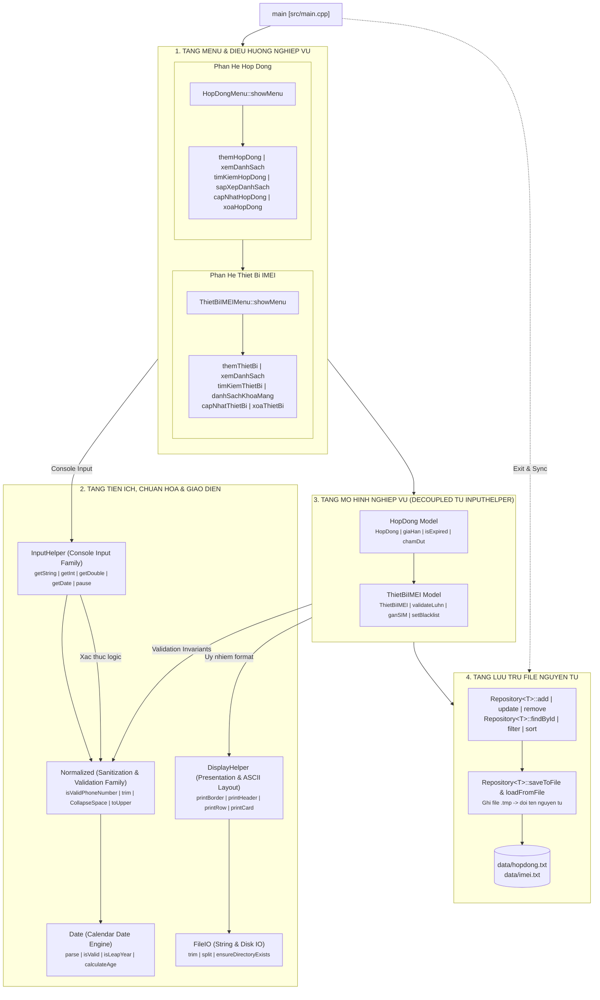
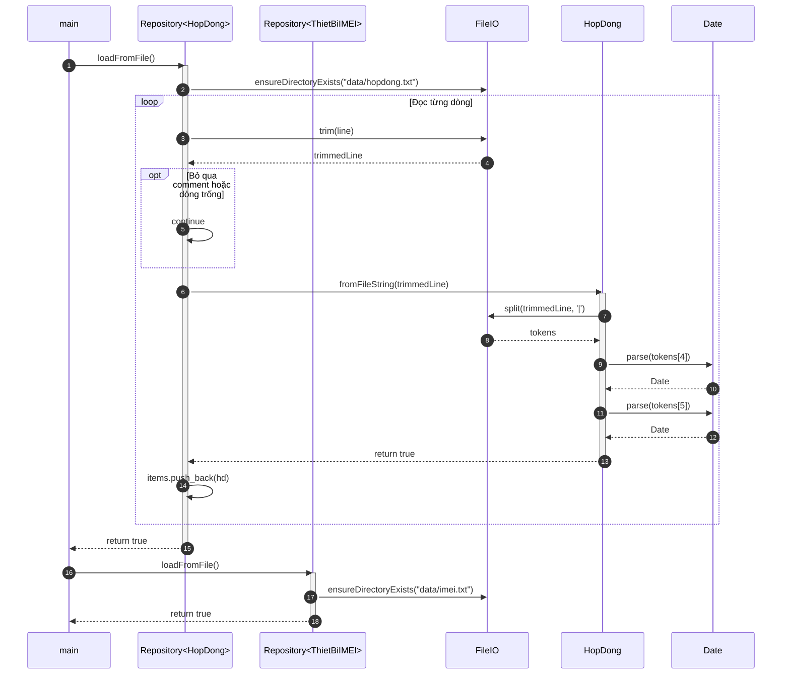
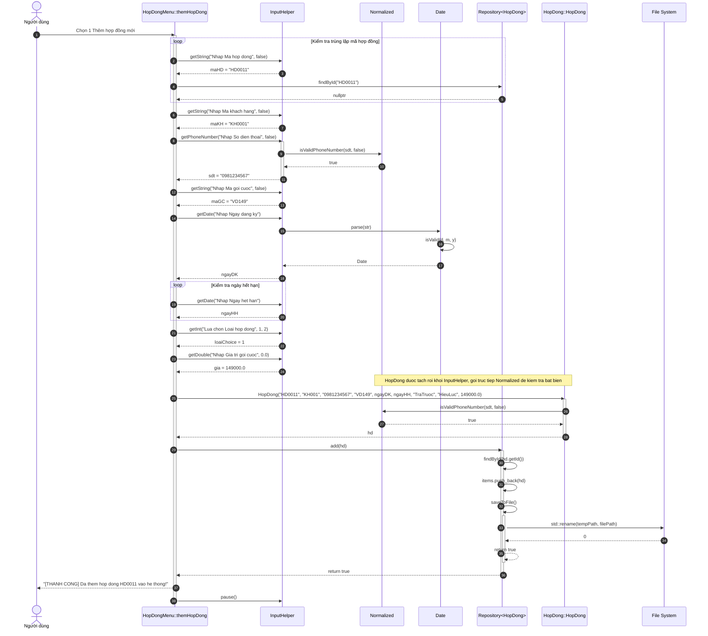
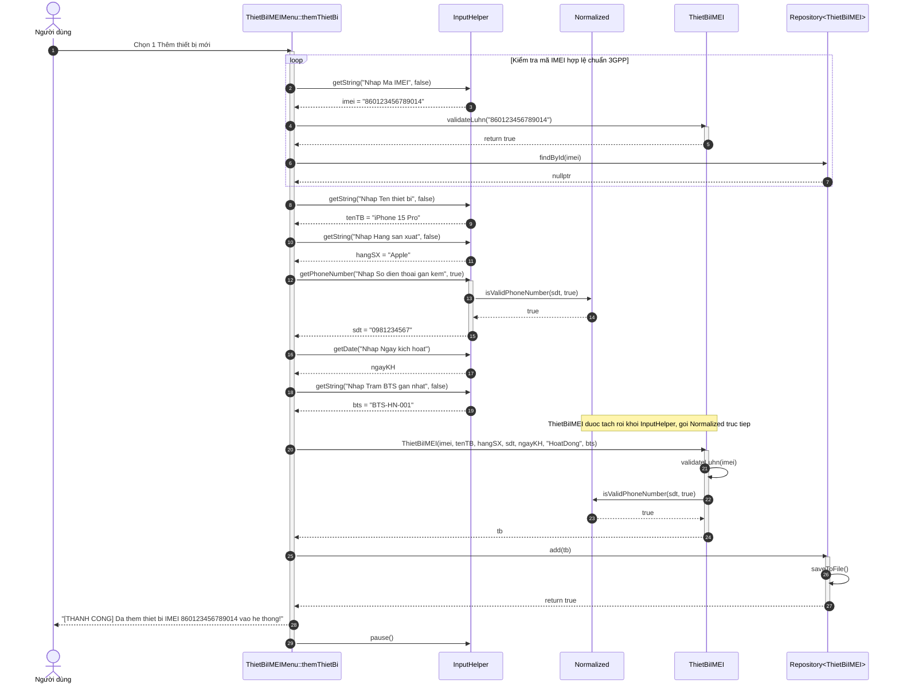

# Đặc Tả Tương Tác Chi Tiết Giữa Các Hàm
## Dự án: Quản Lý Thuê Bao Di Động - PTIT KTLT
### Phụ trách: Trần Đức Anh - B24DCVT021 | Phân hệ: Hợp Đồng & Thiết Bị IMEI

---

> [Thông tin] Công cụ xem sơ đồ tương tác đa màn hình: [INTERACTIVE_DIAGRAMS.html](../Display/INTERACTIVE_DIAGRAMS.html).

---

## 1. Tổng Quan Kiến Trúc Gọi Hàm

Tài liệu này mô tả chi tiết luồng gọi hàm từ cấp độ điều khiển chương trình (`main`), qua các menu tương tác (`HopDongMenu`, `ThietBiIMEIMenu`), đến các hàm tiện ích nhập liệu dòng lệnh (`InputHelper`), bộ tiện ích chuẩn hóa & xác thực (`Normalized`), động cơ hiển thị ASCII (`DisplayHelper`), động cơ lịch (`Date`), các lớp thực thể nghiệp vụ (`HopDong`, `ThietBiIMEI`), và tầng lưu trữ tệp tin nguyên tử (`Repository<T>`, `FileIO`).



### 1.1 Nguyên Tắc Tách Rời Phân Hệ (Decoupling Architecture)
* **Phân định họ hàm nghiêm ngặt:**
  - **`InputHelper` (Console Input Family):** Chuyên trách tương tác bàn phím, điều phối luồng `std::cin`, xóa bộ đệm lỗi (`cin.clear()`, `cin.ignore()`), kiểm tra giới hạn min/max, và xử lý vòng lặp nhập lại trên Console.
  - **`Normalized::isValidPhoneNumber` (Sanitization & Validation Family):** Là hàm thuần túy (pure function) kiểm tra định dạng và đầu số viễn thông Việt Nam (`03`, `05`, `07`, `08`, `09`), hoàn toàn độc lập với console hoặc bất kỳ môi trường I/O nào.
* **Tách rời Domain Models (`HopDong`, `ThietBiIMEI`) khỏi `InputHelper`:**
  - Các lớp mô hình nghiệp vụ (`HopDong`, `ThietBiIMEI`) thuộc tầng Domain Layer **tuyệt đối không phụ thuộc vào `InputHelper`**.
  - Khi cần thẩm định tính hợp lệ của số điện thoại, mô hình gọi trực tiếp `Normalized::isValidPhoneNumber`.
  - Khi cần hiển thị dữ liệu bảng hoặc thẻ chi tiết, mô hình ủy nhiệm cho `DisplayHelper`.
  - Sự tách rời này đảm bảo các lớp mô hình có thể nạp từ file qua `Repository<T>`, chạy hàng loạt test tự động trong `test_runner.cpp`, hoặc mở rộng giao diện đồ họa/API sau này mà không bị kéo theo mã nguồn console.

---

## 2. Chu Trình Sống & Nạp Dữ Liệu Khởi Động

### 2.1 Sơ Đồ Tuần Tự Gọi Hàm Khi Khởi Động Ứng Dụng


---

## 3. Luồng Gọi Hàm: UC01 - Thêm Mới Hợp Đồng Đăng Ký

### 3.1 Sơ Đồ Tuần Tự Gọi Hàm Chi Tiết


---

## 4. Luồng Gọi Hàm: UC02 - Ghi Nhận Thiết Bị & Kiểm Tra Luhn 3GPP

### 4.1 Sơ Đồ Tuần Tự Gọi Hàm Chi Tiết


---

## 5. Luồng Gọi Hàm: Tra Cứu, Lọc & Sắp Xếp Đa Năng

### 5.1 Tra Cứu & Lọc Đa Điều Kiện Với Lambda Expression
```mermaid
sequenceDiagram
    autonumber
    participant Menu as HopDongMenu::timKiemHopDong()
    participant Input as InputHelper
    participant Repo as Repository<HopDong>
    participant HD as HopDong

    Menu->>Input: getInt("Lua chon tra cuu", 0, 3)
    Input-->>Menu: choice = 2

    Menu->>Input: getString("Nhap So dien thoai can tim", false)
    Input-->>Menu: sdt = "0981234567"

    Menu->>Repo: filter([&sdt](const HopDong& hd) { return hd.getSoDienThoai() == sdt; })
    activate Repo
    loop Duyệt từng item trong vector
        Repo->>Repo: predicate(item)
        opt Nếu true
            Repo->>Repo: result.push_back(item)
        end
    end
    Repo-->>Menu: results
    deactivate Repo

    alt Kết quả rỗng
        Menu-->>Menu: In thông báo rỗng
    else Có kết quả
        Menu->>HD: results[0].displayHeader()
        loop Duyệt từng kết quả
            Menu->>HD: hd.displayRow()
        end
    end
```

### 5.2 Sắp Xếp Danh Sách Bằng Thuật Toán Tiêu Chuẩn `std::sort`
```mermaid
sequenceDiagram
    autonumber
    participant Menu as HopDongMenu::sapXepDanhSach()
    participant Input as InputHelper
    participant Repo as Repository<HopDong>
    participant StdSort as std::sort

    Menu->>Input: getInt("Lua chon sap xep", 0, 2)
    Input-->>Menu: choice = 2

    Menu->>Repo: sort([](const HopDong& a, const HopDong& b) { return a.getGiaTriGoi() > b.getGiaTriGoi(); })
    activate Repo
    Repo->>StdSort: std::sort(items.begin(), items.end(), comparator)
    StdSort-->>Repo: Hoàn tất sắp xếp trong RAM
    deactivate Repo

    Menu->>Menu: xemDanhSach()
```

---

## 6. Ma Trận Lan Truyền Ngoại Lệ Giữa Các Hàm

| Lớp Ngoại Lệ | Hàm Phát Sinh | Điều Kiện Kích Hoạt | Hàm Đón Bắt | Hành Vi Xử Lý Ngoại Lệ |
|---|---|---|---|---|
| **`InvalidLuhnException`** | `ThietBiIMEI::ThietBiIMEI`<br/>`ThietBiIMEI::setMaIMEI` | Chuỗi IMEI không thỏa mãn thuật toán Luhn Mod-10 hoặc không đủ 15 chữ số. | `ThietBiIMEIMenu::themThietBi` | In thông báo lỗi, ngăn không cho khởi tạo thực thể lỗi và yêu cầu nhập lại. |
| **`InvalidDateException`** | `Date::parse`<br/>`Date::setDay/Month/Year`<br/>`HopDong::HopDong`<br/>`HopDong::giaHan` | Ngày không hợp lệ hoặc ngày hết hạn nhỏ hơn ngày đăng ký. | `InputHelper::getDate`<br/>`HopDongMenu::capNhatHopDong` | In thông báo chi tiết của lỗi và duy trì vòng lặp nhập liệu an toàn. |
| **`InvalidPhoneNumberException`** | `HopDong::HopDong`<br/>`HopDong::setSoDienThoai`<br/>`ThietBiIMEI::ThietBiIMEI` | Số điện thoại không đủ 10 chữ số hoặc sai đầu số nhà mạng Việt Nam. | `HopDongMenu::capNhatHopDong`<br/>`ThietBiIMEIMenu::capNhatThietBi` | Bắt tại tầng Menu, in cảnh báo và hủy bỏ thao tác gán SIM sai. |
| **`DuplicateIdException`** | `Repository<T>::add` | Mã định danh đã tồn tại trong danh sách RAM của Repository. | `HopDongMenu::themHopDong`<br/>`ThietBiIMEIMenu::themThietBi` | Tầng menu kiểm tra trước qua `findById`; nếu lọt ngoại lệ sẽ in thông báo mã trùng. |
| **`NotFoundException`** | `Repository<T>::update`<br/>`Repository<T>::remove` | Không tìm thấy phần tử có mã cần sửa hoặc xóa. | `HopDongMenu::capNhatHopDong`<br/>`HopDongMenu::xoaHopDong` | In thông báo không tìm thấy mã. |
| **`FileIOException`** | `Repository<T>::saveToFile` | Không thể mở file tạm để ghi hoặc thao tác đổi tên thất bại. | `main` | Bắt ở mức ứng dụng cao nhất, bảo vệ dữ liệu gốc không bị ghi đè khi lỗi ổ đĩa. |

---

## 7. Bảng Đối Chiếu Nguyên Mẫu Hàm Theo Phân Tầng

### 7.1 Lớp `InputHelper` — Console Input Family (`src/lib/shared/InputHelper.h`)
```cpp
static void clearBuffer();
static std::string getString(const std::string& prompt, bool allowEmpty = false);
static int getInt(const std::string& prompt, int minVal = InputLimits::DEFAULT_MIN_INT, int maxVal = InputLimits::DEFAULT_MAX_INT);
static double getDouble(const std::string& prompt, double minVal = InputLimits::DEFAULT_MIN_DOUBLE, double maxVal = InputLimits::DEFAULT_MAX_DOUBLE);
static Date getDate(const std::string& prompt);
static Date getBirthDate(const std::string& prompt, int minAge = 14, int maxAge = 120);
static bool isValidPhoneNumber(const std::string& phone, bool allowUnassigned = false);
static std::string getPhoneNumber(const std::string& prompt, bool allowUnassigned = false);
static bool getConfirm(const std::string& prompt);
static void pause(const std::string& message = "Nhan Enter de tiep tuc...");
```

### 7.2 Phân Hệ `Normalized` — Sanitization & Validation Family (`src/lib/shared/Normalized.h`)
```cpp
namespace Normalized {
    std::string trim(const std::string& str);
    std::string CollapseSpace(const std::string& str);
    std::string removeSymbols(const std::string& str);
    std::string toLower(const std::string& str);
    std::string toUpper(const std::string& str);
    std::string NormalizedName(const std::string& str);
    bool isValidPhoneNumber(const std::string& phone, bool allowUnassigned = false);
}
```

### 7.3 Thư Viện Tiện Ích `DisplayHelper` — Presentation & ASCII Layout (`src/lib/shared/DisplayHelper.h`)
```cpp
namespace DisplayHelper {
    void printBorder(const std::vector<int>& widths, std::ostream& os = std::cout);
    void printHeader(const std::vector<std::string>& headers, const std::vector<int>& widths, const std::vector<bool>& rightAlign = {}, std::ostream& os = std::cout);
    void printRow(const std::vector<std::string>& cells, const std::vector<int>& widths, const std::vector<bool>& rightAlign = {}, std::ostream& os = std::cout);
    void printCard(const std::vector<std::pair<std::string, std::string>>& fields, int labelWidth = 16, std::ostream& os = std::cout);
}
```

### 7.4 Lớp `Repository<T>` — Generic In-Memory CRUD & Flat-File Store (`src/lib/shared/Repository.h`)
```cpp
bool loadFromFile();
bool saveToFile() const;
bool add(const T& item);
bool update(const std::string& id, const T& updatedItem);
bool remove(const std::string& id);
T* findById(const std::string& id);
const T* findById(const std::string& id) const;
std::vector<T> filter(std::function<bool(const T&)> predicate) const;
void sort(std::function<bool(const T&, const T&)> comparator);
```

### 7.5 Lớp `ThietBiIMEI` — Telecom Domain Entity (`src/lib/models/imei.h`)
```cpp
static bool validateLuhn(const std::string& imeiStr);
bool isBlacklisted() const;
void setBlacklist(bool lock);
void ganSIM(const std::string& sdt);
void goSIM();
void capNhatBTS(const std::string& bts);
```

### 7.6 Lớp `HopDong` — Contract Lifecycle Domain Entity (`src/lib/models/hopdong.h`)
```cpp
bool isExpired(const Date& currentDate) const;
void giaHan(const Date& ngayHetHanMoi);
void chamDut();
void tamDung();
void kichHoatLai();
```
