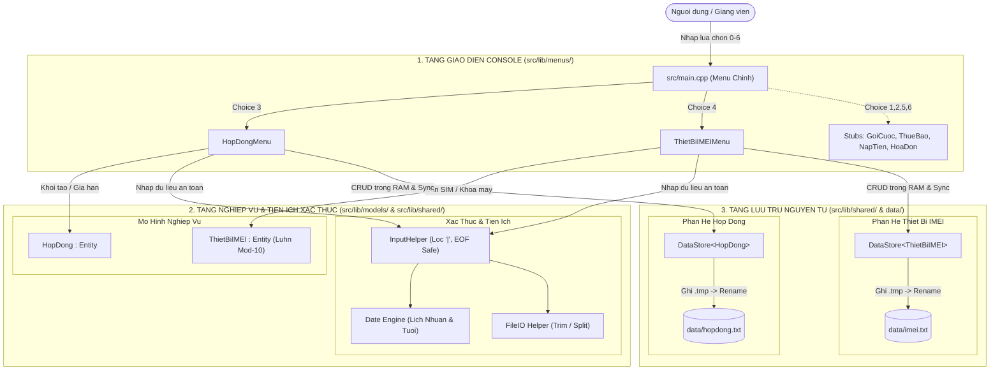
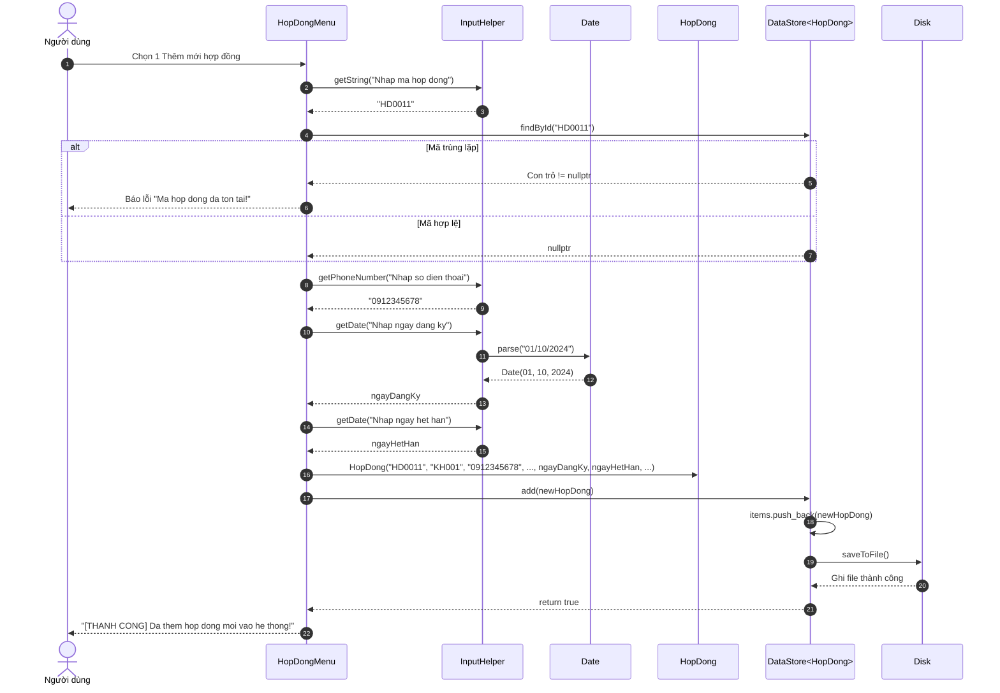
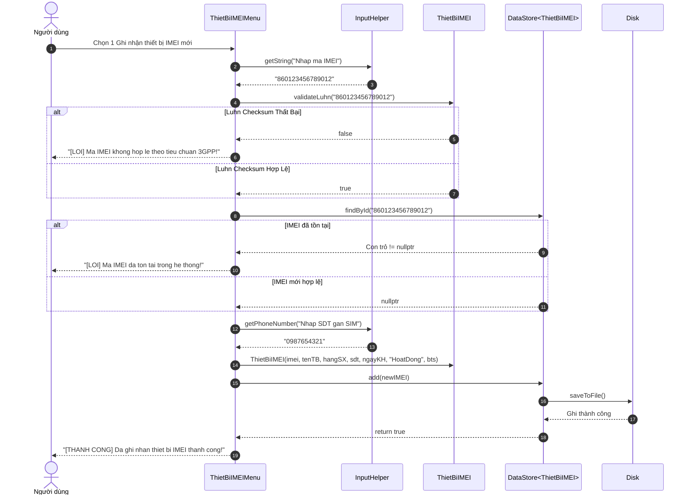
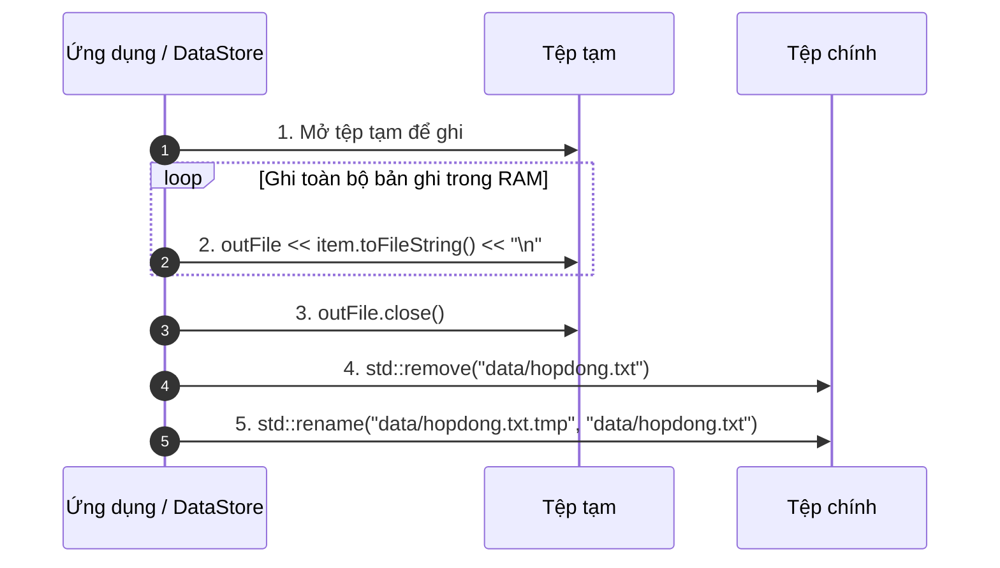
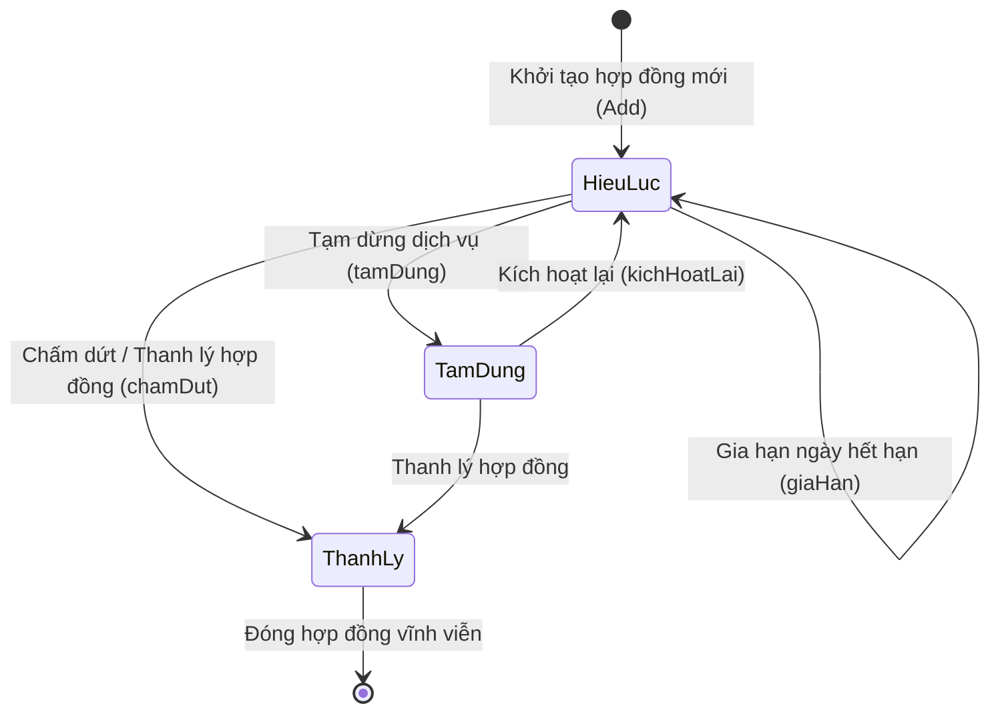
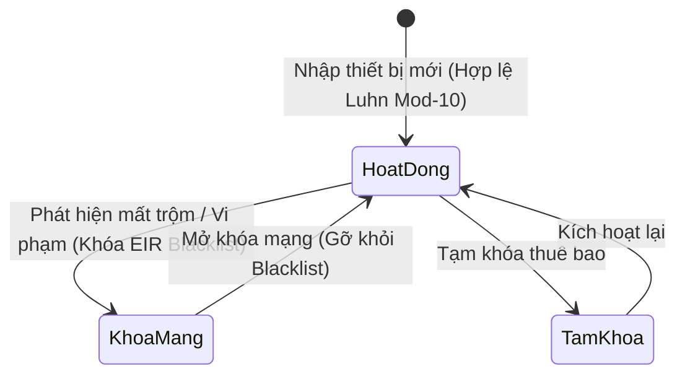

# Sơ Đồ Tương Tác Hệ Thống
## Dự án: Quản Lý Thuê Bao Di Động - PTIT KTLT
### Phụ trách: Trần Đức Anh - B24DCVT021 | Nhánh: DucAnh-B24DCVT021

---

> [Thông tin] Đặc tả luồng gọi hàm chi tiết: Xem tài liệu [FUNCTION_CALLFLOW_SPEC.md](FUNCTION_CALLFLOW_SPEC.md).
> [Thông tin] Công cụ xem sơ đồ tương tác đa màn hình: [INTERACTIVE_DIAGRAMS.html](../Display/INTERACTIVE_DIAGRAMS.html).

---

## 1. Tổng Quan Kiến Trúc Tương Tác Đa Tầng

Hệ thống được thiết kế theo mô hình phân lớp rõ ràng, phân tách hoàn toàn giữa giao diện người dùng console, tầng xử lý nghiệp vụ, tầng xác thực dữ liệu và tầng lưu trữ tệp tin nguyên tử.

---

## 2. Sơ Đồ Tuần Tự — UC01: Thêm Mới Hợp Đồng Đăng Ký

Quy trình người dùng tạo hợp đồng mới, xác thực số điện thoại 10 chữ số, ngày tháng hợp lệ và lưu trữ vào cơ sở dữ liệu:

---

## 3. Sơ Đồ Tuần Tự — UC02: Ghi Nhận IMEI & Kiểm Tra Chuẩn 3GPP Luhn

Quy trình nhập mã IMEI 15 chữ số, chạy thuật toán Luhn Mod-10, gán SIM và lưu trữ:

---

## 4. Sơ Đồ Tương Tác Lưu Trữ
Quy trình đảm bảo cơ sở dữ liệu file phẳng không bao giờ bị hỏng kể cả khi chương trình bị tắt đột ngột:

---

## 5. Sơ Đồ Chuyển Trạng Thái Vòng Đời

### 5.1 Vòng Đời Hợp Đồng

### 5.2 Vòng Đời Trạng Thái Thiết Bị IMEI

---

## 6. Công Cụ Trực Quan Hóa Sơ Đồ Có Sẵn Trong Dự Án

Bên cạnh tài liệu Markdown này, dự án cung cấp 2 công cụ trực quan hóa tương tác:

1. **`graphify-out/KTLT-callflow.html`**:
   - Chứa 11 sơ đồ Mermaid và 10 bảng phân tích quan hệ gọi hàm (Call tables) tự động trích xuất từ toàn bộ mã nguồn C++.
   - Mở xem trực tiếp trên trình duyệt: `xdg-open graphify-out/KTLT-callflow.html`.
2. **`graphify-out/GRAPH_TREE.html`**:
   - Cây phân cấp mã nguồn tương tác D3.js dạng Collapsible Tree.
   - Mở xem: `xdg-open graphify-out/GRAPH_TREE.html`.
