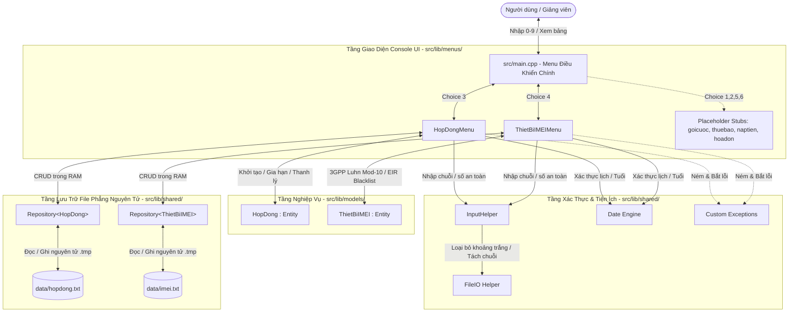
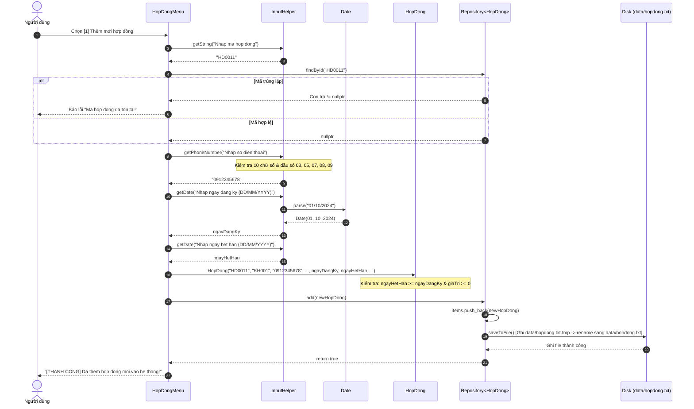
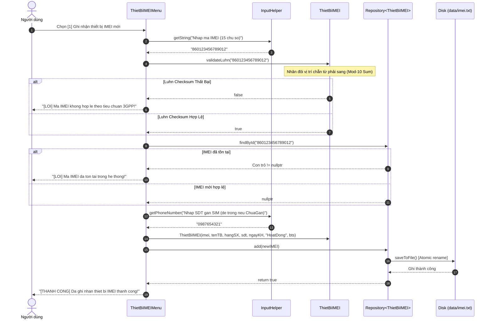
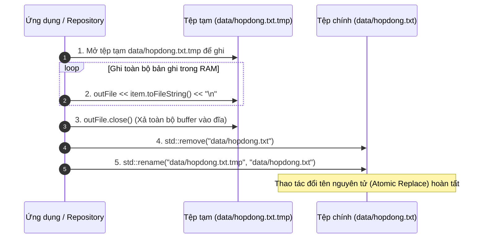
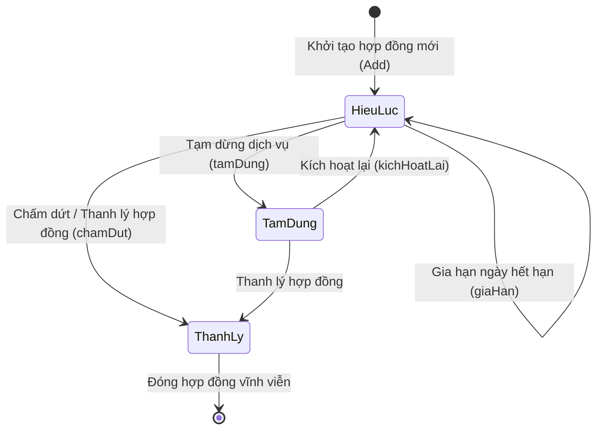
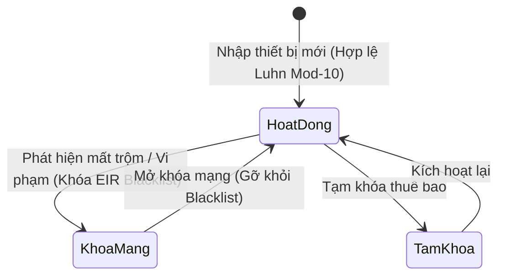

# Sơ Đồ Tương Tác Hệ Thống (Interaction & Sequence Diagrams)
## Dự án: Quản Lý Thuê Bao Di Động (Topic 1 - PTIT KTLT)
### Phụ trách: Trần Đức Anh (B24DCVT021) | Nhánh: `DucAnh-B24DCVT021`

---

## 1. Tổng Quan Kiến Trúc Tương Tác Đa Tầng (Multi-Tier Interaction)

Hệ thống được thiết kế theo mô hình phân lớp rõ ràng (**Layered Architecture**), phân tách hoàn toàn giữa giao diện người dùng console, tầng xử lý nghiệp vụ, tầng xác thực dữ liệu và tầng lưu trữ tệp tin nguyên tử.

---

## 2. Sơ Đồ Tuần Tự (Sequence Diagram) — UC01: Thêm Mới Hợp Đồng Đăng Ký

Quy trình người dùng tạo hợp đồng mới, xác thực số điện thoại 10 chữ số, ngày tháng hợp lệ và lưu trữ vào cơ sở dữ liệu:

---

## 3. Sơ Đồ Tuần Tự (Sequence Diagram) — UC02: Ghi Nhận IMEI & Kiểm Tra Chuẩn 3GPP Luhn

Quy trình nhập mã IMEI 15 chữ số, chạy thuật toán Luhn Mod-10, gán SIM và lưu trữ:

---

## 4. Sơ Đồ Tương Tác Lưu Trữ Nguyên Tử (Atomic Persistence Engine)

Quy trình đảm bảo cơ sở dữ liệu file phẳng không bao giờ bị hỏng (corrupted) kể cả khi chương trình bị tắt đột ngột:

---

## 5. Sơ Đồ Chuyển Trạng Thái Vòng Đời (State Transition Diagram)

### 5.1 Vòng Đời Hợp Đồng (`HopDong`)

### 5.2 Vòng Đời Trạng Thái Thiết Bị IMEI (`ThietBiIMEI`)

---

## 6. Công Cụ Trực Quan Hóa Sơ Đồ Có Sẵn Trong Dự Án

Bên cạnh tài liệu Markdown này, dự án cung cấp 2 công cụ trực quan hóa tương tác:

1. **`graphify-out/KTLT-callflow.html`**:
   - Chứa 11 sơ đồ Mermaid và 10 bảng phân tích quan hệ gọi hàm (Call tables) tự động trích xuất từ toàn bộ mã nguồn C++.
   - Mở xem trực tiếp trên trình duyệt: `xdg-open graphify-out/KTLT-callflow.html`.
2. **`graphify-out/GRAPH_TREE.html`**:
   - Cây phân cấp mã nguồn tương tác D3.js dạng Collapsible Tree.
   - Mở xem: `xdg-open graphify-out/GRAPH_TREE.html`.
